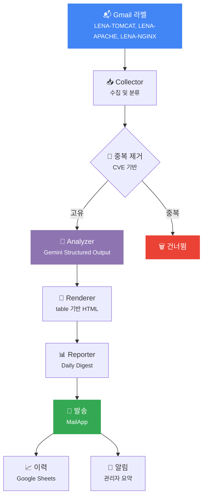

<p align="center">
  <a href="README.md">English</a> | <a href="README.ko.md">한국어</a>
</p>

<p align="center">
  
</p>

<p align="center">
  <strong>Gemini AI 기반 보안 메일 자동 분석 시스템</strong><br/>
  Gmail에서 보안 공지를 수집하고, AI로 CVE를 분석하여 일일 종합 보고서를 발송합니다.
</p>

<p align="center">
  
  
  
  
  
</p>

---

## ✨ 주요 기능

<table>
<tr>
<td width="50%">

### 📬 스마트 메일 수집
- Gmail 라벨 기반 자동 수집
- 제품별 키워드 필터링
- 공유 라벨 제품 자동 분류 (Tomcat/TomEE)
- CVE 추출 및 중복 제거

</td>
<td width="50%">

### 🤖 AI 기반 분석
- Gemini Structured Output (JSON Schema)
- CVSS 점수 및 심각도 평가
- LENA 버전 영향도 분석
- Few-shot 프롬프팅으로 일관성 확보

</td>
</tr>
<tr>
<td width="50%">

### 📊 이중 보고서
- 경영진용 Executive Summary
- 기술진용 Technical Details
- CVE 심각도 테이블 (NVD 링크 포함)
- LENA 버전 영향도 매트릭스

</td>
<td width="50%">

### 📧 기업용 이메일
- Outlook 호환 HTML (MSO 조건부 주석)
- table 기반 레이아웃 (CSS Grid/Flex 미사용)
- WCAG 4.5:1 색상 대비 준수
- TLP 등급 배지

</td>
</tr>
<tr>
<td width="50%">

### 📈 이력 관리
- Google Sheets CVE 이력
- 발송 이력 상태 추적
- 캐시 기반 O(1) 중복 탐지
- 주간 자동 정리

</td>
<td width="50%">

### 🔔 관리자 알림
- 에러 알림 (일일 10건 제한)
- 일일 처리 결과 요약
- 치명적 오류 에스컬레이션
- 스택 트레이스 리포팅

</td>
</tr>
</table>

---

## 🎯 모니터링 대상 제품

| 제품 | Gmail 라벨 | 현재 버전 | NVD 접두사 |
|------|:-----------:|----------|-----------|
| **Apache HTTP Server** | `LENA-APACHE` | `2.4.66` | `cpe:2.3:a:apache:http_server` |
| **Apache Tomcat** | `LENA-TOMCAT` | `7.0.107` `8.5.100` `9.0.113` `10.1.50` | `cpe:2.3:a:apache:tomcat` |
| **Apache TomEE** | `LENA-TOMCAT` | `1.7.2` `7.1.4` `8.0.16` | `cpe:2.3:a:apache:tomee` |
| **Nginx** | `LENA-NGINX` | `1.29.3` | `cpe:2.3:a:f5:nginx` |

---

## 🏗️ 아키텍처



---

## 📁 프로젝트 구조

```
lena-ai-security/
├── 🔧 Config.js          # 제품 설정, API 키 관리, 상수 정의
├── 🚀 Main.js            # 파이프라인 오케스트레이터 (메인 진입점)
├── 📥 Collector.js        # 메일 수집, 제품 분류, 중복 제거
├── 🤖 Analyzer.js         # Gemini Structured Output 기반 분석
├── 🧠 AI.js               # Gemini API 호출, 프롬프트 생성
├── 📐 Schema.js           # Gemini 응답 JSON Schema 정의
├── 🎨 Renderer.js         # table 기반 HTML 이메일 템플릿 엔진
├── 📊 Reporter.js         # Daily Digest 통합 보고서 조립
├── 📧 Email.js            # 레거시 HTML 보고서 생성
├── 📈 History.js          # Google Sheets 이력 관리
├── 🔔 Notifier.js         # 관리자 알림 (에러/일일 요약)
├── ⚙️ Setup.js            # 초기 설정 마법사
├── 🧪 Test.js             # 단위 테스트
├── 📋 Core.js             # 레거시 핵심 로직
└── 📄 appsscript.json     # Apps Script 매니페스트
```

---

## 🚀 빠른 시작

### 사전 요구사항

- Gmail이 있는 Google 계정
- [Gemini API 키](https://aistudio.google.com/app/apikey)
- [clasp](https://github.com/google/clasp) (로컬 개발 시)

### 1. 클론 및 배포

```bash
npm install -g @google/clasp
clasp login
clasp clone <스크립트_ID> --rootDir .
```

### 2. API 키 설정

Apps Script 편집기에서 `setupApiKey()` 실행:

```javascript
function setupApiKey() {
  PropertiesService.getScriptProperties().setProperty(
    "GEMINI_API_KEY", "여기에_API_키_입력"
  );
}
```

> ⚠️ **실행 후 반드시 소스 코드에서 API 키를 제거하세요.**

### 3. 설정 마법사 실행

```javascript
runSetupWizard()  // 스프레드시트, 라벨, 트리거 자동 생성
```

### 4. 설정 확인

```javascript
checkConfiguration()  // 전체 설정 상태 검증
```

> 📖 전체 설정 가이드는 [QUICKSTART.md](QUICKSTART.md)를 참조하세요.

---

## 📬 동작 방식

```
1️⃣  트리거가 매일 08:00 KST에 실행 (평일만)
2️⃣  Collector가 Gmail 라벨에서 미읽은 보안 메일 수집
3️⃣  메일을 제품별로 분류하고 CVE 기반 중복 제거
4️⃣  Gemini AI가 Structured Output으로 각 메일 분석
5️⃣  분석 결과를 Outlook 호환 HTML로 렌더링
6️⃣  Daily Digest 보고서를 보안팀에 발송
7️⃣  CVE 이력을 Google Sheets에 기록
8️⃣  관리자에게 처리 결과 요약 발송
```

---

## 🧪 테스트

Apps Script 편집기에서 `testAll()` 실행:

```
✓ testBuildEngineVersions    — 엔진 버전 맵 생성
✓ testGetApiKey              — API 키 설정/에러 경로
✓ testExtractCveIds          — CVE 정규식 추출 및 중복 제거
✓ testGroupAndDeduplicate    — 메일 그룹핑 및 CVE 중복 제거
✓ testSchemaValidity         — Gemini 응답 스키마 검증
✓ testCveSeverityTable       — HTML 렌더링 및 심각도 정렬
✓ testAggregateStats         — 통계 집계
✓ testBuildDigestSubject     — Digest 제목 생성
=== ALL TESTS PASSED ===
```

> 📖 전체 테스트 가이드는 [TESTING.md](TESTING.md)를 참조하세요.

---

## 📖 문서

| 문서 | 설명 |
|------|------|
| [**QUICKSTART.md**](QUICKSTART.md) | 초기 설정 가이드 |
| [**DEPLOYMENT.md**](DEPLOYMENT.md) | 배포, 트리거, 설정 관리 |
| [**TESTING.md**](TESTING.md) | 단위 테스트 및 디버깅 |
| [**CONTRIBUTING.md**](CONTRIBUTING.md) | 개발 워크플로우 및 코딩 규칙 |

---

## ⚙️ 설정 항목

| 변수 | 기본값 | 설명 |
|------|--------|------|
| `MODEL_NAME` | `gemini-3-flash-preview` | Gemini 모델명 |
| `MAX_THREADS` | `10` | 라벨당 최대 Gmail 스레드 수 |
| `MAX_BODY_LENGTH` | `10000` | 분석 대상 본문 최대 길이 |
| `API_CALL_DELAY` | `3000ms` | API 호출 간 대기 시간 |
| `MAX_RETRIES` | `3` | API 최대 재시도 횟수 |
| `TLP_LEVEL` | `TLP:AMBER` | 보고서 TLP 등급 |

---

## 📄 라이선스

이 프로젝트는 [MIT 라이선스](LICENSE)로 배포됩니다.

---

<p align="center">
  <sub>Powered by <strong>Gemini AI</strong> · Built with <strong>Google Apps Script</strong></sub><br/>
  <sub>Made with ❤️ by the LENA Security Team</sub>
</p>
