<p align="center">
  <a href="README.md">English</a> | <a href="README.ko.md">한국어</a>
</p>

<p align="center">
  
</p>

<p align="center">
  <strong>Automated security mail analysis powered by Gemini AI</strong><br/>
  Collects security advisories from Gmail, analyzes CVEs with AI, and delivers daily digest reports.
</p>

<p align="center">
  
  
  
  
  
</p>

---

## ✨ Features

<table>
<tr>
<td width="50%">

### 📬 Smart Mail Collection
- Gmail label-based auto-collection
- Keyword filtering per product
- Smart product classification (shared labels)
- CVE extraction with deduplication

</td>
<td width="50%">

### 🤖 AI-Powered Analysis
- Gemini Structured Output (JSON Schema)
- CVSS score & severity assessment
- Version impact analysis
- Few-shot prompting for consistency

</td>
</tr>
<tr>
<td width="50%">

### 📊 Dual Reporting
- Executive Summary (for management)
- Technical Details (for engineers)
- CVE severity table with NVD links
- LENA version impact matrix

</td>
<td width="50%">

### 📧 Enterprise Email
- Outlook-compatible HTML (MSO conditionals)
- Table-based layout (no CSS Grid/Flex)
- WCAG 4.5:1 color contrast
- TLP classification badges

</td>
</tr>
<tr>
<td width="50%">

### 📈 History & Tracking
- Google Sheets CVE history
- Send history with status tracking
- Cached O(1) duplicate detection
- Weekly auto-cleanup

</td>
<td width="50%">

### 🔔 Admin Notifications
- Error alerts with rate limiting (10/day)
- Daily processing summary
- Fatal error escalation
- Stack trace reporting

</td>
</tr>
</table>

---

## 🎯 Monitored Products

| Product | Gmail Label | Current Versions | NVD Prefix |
|---------|:-----------:|-----------------|------------|
| **Apache HTTP Server** | `LENA-APACHE` | `2.4.66` | `cpe:2.3:a:apache:http_server` |
| **Apache Tomcat** | `LENA-TOMCAT` | `7.0.107` `8.5.100` `9.0.113` `10.1.50` | `cpe:2.3:a:apache:tomcat` |
| **Apache TomEE** | `LENA-TOMCAT` | `1.7.2` `7.1.4` `8.0.16` | `cpe:2.3:a:apache:tomee` |
| **Nginx** | `LENA-NGINX` | `1.29.3` | `cpe:2.3:a:f5:nginx` |

---

## 🏗️ Architecture

```mermaid
flowchart TD
    A["📬 Gmail Labels<br/><small>LENA-TOMCAT, LENA-APACHE, LENA-NGINX</small>"] --> B["📥 Collector<br/><small>Collect & Classify</small>"]
    B --> C{"🔄 Dedup<br/><small>CVE-based</small>"}
    C -->|Unique| D["🤖 Analyzer<br/><small>Gemini Structured Output</small>"]
    C -->|Duplicate| X["🗑️ Skip"]
    D --> E["🎨 Renderer<br/><small>Table-based HTML</small>"]
    E --> F["📊 Reporter<br/><small>Daily Digest</small>"]
    F --> G["📧 Send<br/><small>MailApp</small>"]
    G --> H["📈 History<br/><small>Google Sheets</small>"]
    G --> I["🔔 Notifier<br/><small>Admin Summary</small>"]

    style A fill:#4285F4,color:#fff,stroke:none
    style D fill:#8E75B2,color:#fff,stroke:none
    style G fill:#34A853,color:#fff,stroke:none
    style X fill:#EA4335,color:#fff,stroke:none
```



---

## 📁 Project Structure

```
lena-ai-security/
├── 🔧 Config.js          # Product config, API keys, constants
├── 🚀 Main.js            # Pipeline orchestrator (entry point)
├── 📥 Collector.js        # Mail collection, classification, dedup
├── 🤖 Analyzer.js         # Gemini Structured Output analysis
├── 🧠 AI.js               # Gemini API calls, prompt engineering
├── 📐 Schema.js           # JSON Schema for Gemini responses
├── 🎨 Renderer.js         # Table-based HTML email template engine
├── 📊 Reporter.js         # Daily Digest assembly
├── 📧 Email.js            # Legacy HTML report builder
├── 📈 History.js          # Google Sheets history management
├── 🔔 Notifier.js         # Admin alerts & daily summary
├── ⚙️ Setup.js            # Setup wizard (API key, labels, triggers)
├── 🧪 Test.js             # Unit tests
├── 📋 Core.js             # Legacy core logic
└── 📄 appsscript.json     # Apps Script manifest
```

---

## 🚀 Quick Start

### Prerequisites

- Google Account with Gmail
- [Gemini API Key](https://aistudio.google.com/app/apikey)
- [clasp](https://github.com/google/clasp) (for local development)

### 1. Clone & Deploy

```bash
npm install -g @google/clasp
clasp login
clasp clone <SCRIPT_ID> --rootDir .
```

### 2. Set API Key

Run `setupApiKey()` in the Apps Script editor:

```javascript
function setupApiKey() {
  PropertiesService.getScriptProperties().setProperty(
    "GEMINI_API_KEY", "YOUR_KEY_HERE"
  );
}
```

> ⚠️ **Remove the key from source code after running.**

### 3. Run Setup Wizard

```javascript
runSetupWizard()  // Creates spreadsheet, labels, triggers
```

### 4. Verify

```javascript
checkConfiguration()  // Validates all settings
```

> 📖 See [QUICKSTART.md](QUICKSTART.md) for the full setup guide.

---

## 📬 How It Works

```
1️⃣  Trigger fires daily at 08:00 KST (weekdays only)
2️⃣  Collector scans Gmail labels for unread security mails
3️⃣  Mails are classified by product and deduplicated by CVE
4️⃣  Gemini AI analyzes each mail with Structured Output
5️⃣  Results are rendered into Outlook-compatible HTML
6️⃣  Daily Digest report is sent to the security team
7️⃣  CVE history is recorded in Google Sheets
8️⃣  Admin receives a processing summary
```

---

## 🧪 Testing

Run `testAll()` in the Apps Script editor:

```
✓ testBuildEngineVersions    — Engine version map generation
✓ testGetApiKey              — API key setup/error paths
✓ testExtractCveIds          — CVE regex extraction & dedup
✓ testGroupAndDeduplicate    — Mail grouping & CVE dedup
✓ testSchemaValidity         — Gemini response schema
✓ testCveSeverityTable       — HTML rendering & severity sort
✓ testAggregateStats         — Statistics aggregation
✓ testBuildDigestSubject     — Digest subject generation
=== ALL TESTS PASSED ===
```

> 📖 See [TESTING.md](TESTING.md) for the full testing guide.

---

## 📖 Documentation

| Document | Description |
|----------|-------------|
| [**QUICKSTART.md**](QUICKSTART.md) | First-time setup guide |
| [**DEPLOYMENT.md**](DEPLOYMENT.md) | Deployment, triggers, and configuration |
| [**TESTING.md**](TESTING.md) | Unit tests and debugging |
| [**CONTRIBUTING.md**](CONTRIBUTING.md) | Development workflow and coding standards |

---

## ⚙️ Configuration

| Variable | Default | Description |
|----------|---------|-------------|
| `MODEL_NAME` | `gemini-3-flash-preview` | Gemini model |
| `MAX_THREADS` | `10` | Max Gmail threads per label |
| `MAX_BODY_LENGTH` | `10000` | Max mail body for analysis |
| `API_CALL_DELAY` | `3000ms` | Delay between API calls |
| `MAX_RETRIES` | `3` | API retry attempts |
| `TLP_LEVEL` | `TLP:AMBER` | Report classification |

---

## 📄 License

This project is licensed under the [MIT License](LICENSE).

---

<p align="center">
  <sub>Powered by <strong>Gemini AI</strong> · Built with <strong>Google Apps Script</strong></sub><br/>
  <sub>Made with ❤️ by the LENA Security Team</sub>
</p>
